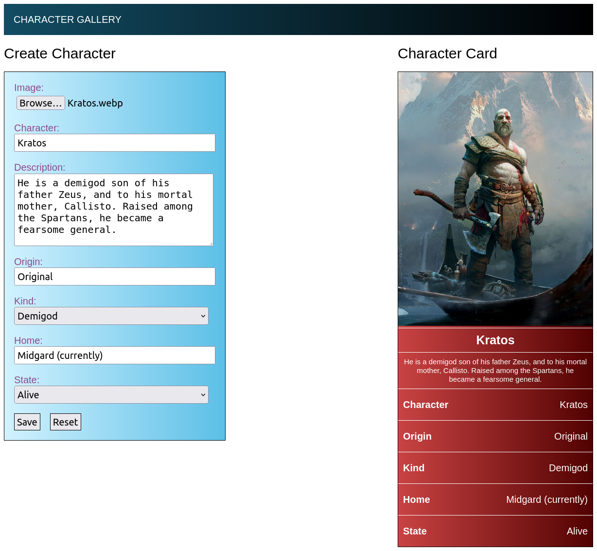
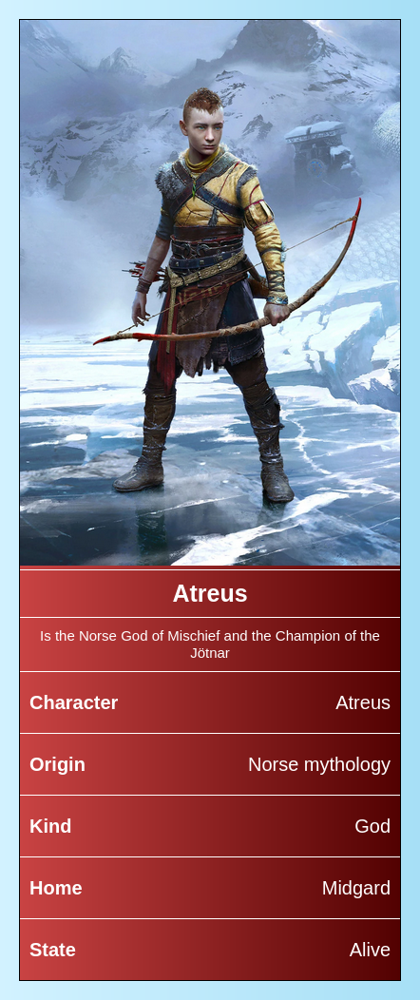

# CreateCharacterCard
Un creador de cartas de personajes básico utilizando solo JavaScript

[https://gabriser.github.io/CreateCharacterCard/](https://gabriser.github.io/CreateCharacterCard/)

## Descripción

Página web básica que permite crear una carta de personaje a partir de un formulario dinámico utilizando clases JavaScript ES5 y LocalStorage.

### Crear una carta

La carta comienza a generarse dinámicamente la primera vez que se complete un campo del formulario de la izquierda.

Puede añadir una imagen directamente de su dispositivo utilizando el boton *Browse...*.

### Reiniciar la carta

Puede reiniciar los datos de la carta utilizando el boton *Reset*.

### Guardar la carta localmente

Puede guardar la carta utilizando el LocalStorage del navegador web utilizando el boton *Save*.

### Visualizar la carta localmente

Puede visualizar la carta desde el apartado *CHARACTER GALLERY* en la parte superior.

Una vez dentro de la galeria, puedes visualizar la carta utilizando el boton *Load Cards*.

### Borrar la carta localmente

Puede eliminar la carta utilizando el boton *Delete Cards*.

## Agradecientos

- **Imágenes de ejemplo** : God of War ([Santa Monica Studio](https://sms.playstation.com/), Sony Interactive Entertainment).